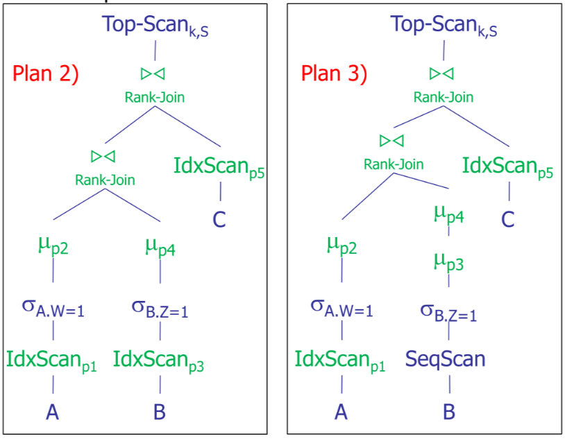


Una delle sfide nelle query [top k](/tecnologie_basi_dati/top_k_queries) e quello  di introdurre nei DBMS il concetto di ranking, come first class citizen, un primo approccio al problema e stato fornito dal progetto RankDB definendo i seguenti concetti:

- splitting e interleaving del ranking degli oggetti
- relazione-rank e il principio di ranking
- rank-algebra pensata per le relazioni-rank

## Relazione rank

Una relazione rank e definita come segue

>[!CITE] data una relazione \\(R\\) e una funzione di scoring monotona \\(S(p_1,p_2,...,p_m)\\)  una relazione rank  \\(R_P\\) si definisce come una relazione dove gli oggetti sono ordinati per valore decrescente di \\(S_P^+(t)\\) dove \\(S_P^+(t)\\) e definito come il massimo possibile score della tupla \\(t\\)

## Rank algebra

Pensata come estensione per supportare le [Relazioni rank](#relazione-rank), introduce l'operatore \\(\mu\\) che applica una preferenza alla relazione rank \\(R_P\\)

Grazie all'operatore \\(\mu\\) e possibile l'interleaving con altri operatori \\(\sigma(\mu(R_P))\\)

