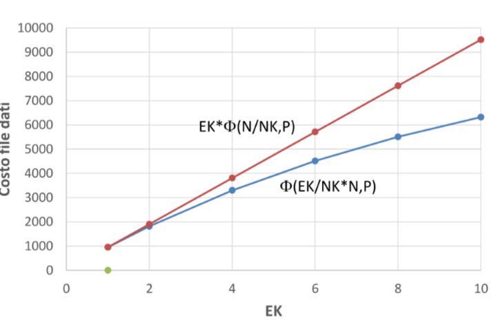


Data una query di selezione come la seguente

```sql
SELECT *
FROM Recensioni R
WHERE R.rivista='Sapore DiVino'
```

L'obbiettivo e quello di determinare qual'e la strategia di accesso migliore, questo può dipendere da diversi fattori

## Stimare il numero di risultati

L'efficienza di due strategie di selezione e fortemente dipendente dal numero di record del risultato, non e possibile ovviamente saperlo a priori ma si può ottenere una stima come \\(E = f\times N\\) dove:

- \\(E\\) record in output stimati
- \\(N\\) numero di record in input
- \\(f\\) e il **fattore di selettività della query**, una query e molto selettiva se \\(f\\) piccolo

> [!NOTE] se i valori dell'attributo di selezione sono uniformemente distribuiti allora \\(f = E/N\\)

Anche in questo caso il costo dipende dalla presenza o meno di indici

- se non ci sono indici si deve leggere tutto il file dati (*costo \\(P\\)*)
- indice clustered (costo \\(h-1 + f*L + f*P\\))
- indice un-clustered (costo \\(h-1 + f*L + E *\Phi(N/NK,P)\\)) (*si fa uso del [Modello di cardenas](/tecnologie_basi_dati/b+tree#modello-di-cardenas)*)

## Selezione alternativa con indice un-clustered

In caso di indice un-clustered si può decidere di ordinare i RID prima di accedere al file dati per ottimizzarne l'accesso



## Selezioni con condizioni multi-attributo

In caso di condizioni multi-attributo l'utilizzo di indici non e sempre possibile, in particolare:

- gli [indici hash](/tecnologie_basi_dati/indici_hash) possono essere utilizzati solo se sono presenti termini di uguaglianza per ogni attributo chiave dell'indice
- i [b+tree](/tecnologie_basi_dati/b+tree) possono essere utilizzati solo se i termini presenti compongono un prefisso delle chiavi dell'albero (*si fa riferimento a [indici multi attributo](/tecnologie_basi_dati/b+tree#ricerche-multi-attributo)*)

## Selezioni senza disgiunzione

In caso di condizioni senza disgiunzione (*condizioni in `AND`*)  si applicano i metodi di accesso per i **predicati risolubili e poi si valutano i predicati residui**

È possibile usare più indici e poi fare l'intersezione dei risultati

## Selezione con disgiunzioni

In caso di predicati in disgiunzione (*condizioni in `OR`*) se anche **solo una condizione non e risolubile si deve scandire il file**, altrimenti si utilizzano gli indici e si fa l'unione del risultato

## Db2, tipologie di predicato

Per poter valutare un interrogazione, DB2 distingue fra 4 diverse tipologie di predicati di ricerca

| Tipo             | Descrizione                                                                            |
| ---------------- | -------------------------------------------------------------------------------------- |
| Range delimiting | predicati che delimitano il range di foglie a cui accedere                             |
| Index SARGable   | non delimitano il range di foglie ma escludono elementi durante la ricerca nell'indice |
| data SARGable    | predicati che possono essere applicati nel momento di accesso ai dati                  |
| Residual         | Predicati residui, risolti in memoria centrale                                         |

Ogni tipo di predicato a effetti diversi sull'efficienza di una query, in particolare:

|                           | range delimiting | index SARGable | data SARGable | Residual |
| ------------------------- | ---------------- | -------------- | ------------- | -------- |
| riduzione index I/O       | SI               | NO             | NO            | NO       |
| Riduzione Data I/O        | SI               | SI             | NO            | NO       |
| Riduzione numero di tuple | SI               | SI             | SI            | NO       |
| Riduzione output finale   | SI               | SI             | SI            | SI       |

