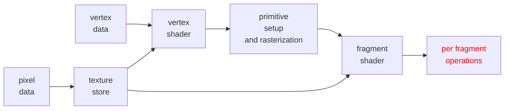
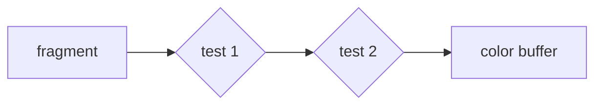


La pipeline grafica di [WebGL](/computer_graphics/webgl) consente di applicare tecniche avanzate di rendering modificandone i componenti



## Per fragment operations

Fase della pipeline che consente di eseguire operazioni custom sui fragment per mezzo di **buffer** un esempio e il [test di profondità](/computer_graphics/real_time_rendering#algoritmo-z-buffer)

Le operazioni svolte in questa fase prendono il nome di test, ognuna di esse e associata a un buffer di memoria che viene utilizzato per eseguire le operazioni sui fragment

I test consistono in espressioni booleane  sui singoli fragment, se l'espressione risulta vera il fragment procede nella pipeline altrimenti viene scartato



### Scissor test

Permette di restringere il campo visibile a una regione della viewport

```javascript
gl.scissor(x, y, width, height);
gl.enable(gl.SCISSOR_TEST);
```

### Depth test

Implementa l'algoritmo [algoritmo z-buffer](/computer_graphics/real_time_rendering#algoritmo-z-buffer)

```javascript
gl.enable( gl.DEPTH_TEST );
gl.clearDepth(1.0)
```

È possibile cambiare il confronto effettuato nel depth buffer tramite la funzione `gl.depthFunc( func );` dove `func` può avere uno dei seguenti valori

```javascript
gl.NEVER
gl.LESS //default
gl.LEQUAL
gl.EQUAL
gl.NOTEQUAL
gl.GEQUAL
gL.GREATER
gl.ALWAYS
```

### Alpha test

Simula l'effetto di elementi traslucidi come vetro o acqua per mezzo di una quarta componente colore

```javascript
gl.enable(gl.BLEND) //necessario per abiitare l'alpha test
```

### Stencil test

Permette di controllare l'area di disegno sfruttando maschere

```javascript
// inizializza e ripulisce lo stencil buffer
gl.enable( gl.STENCIL_TEST );
gl.clearStencil( 0x0 );

// determina la funzione di confronto del buffer, il valore di confronto e la maschera dove applicare lo stencil buffer
gl.stencilFunc( gl.ALWAYS, 0x1, 0x1 );

// operazione da applicare agli elementi che passano lo stencil test
gl.stencilOp( gl.REPLACE, gl.REPLACE, gl.REPLACE );
```
