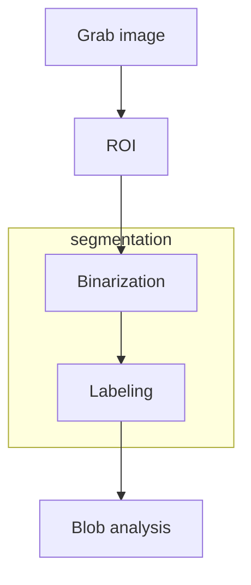

# Computer vision industrial workflow

Computer vision processes in industrial environment follow this schema

```mermaid
flowchart TD
A[Grab image]
B[ROI]
subgraph segmentation
C[Binarization]
D[Labeling]
end
E[Blob analysis]
A --> B
B --> C
C --> D
D --> E
```

