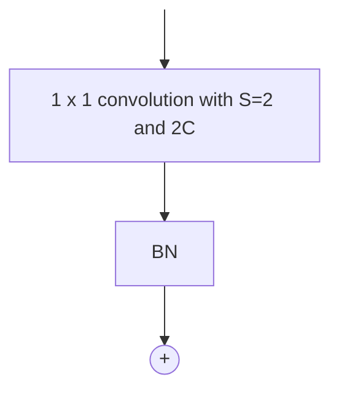
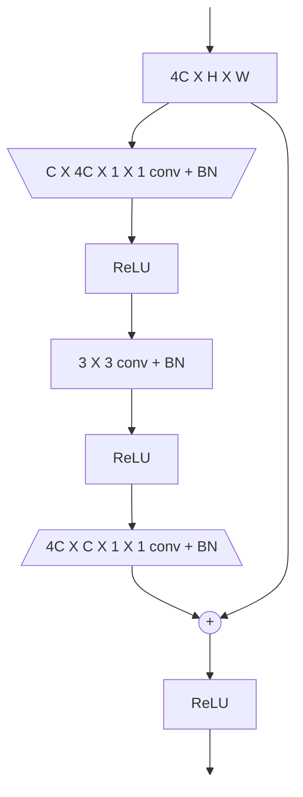
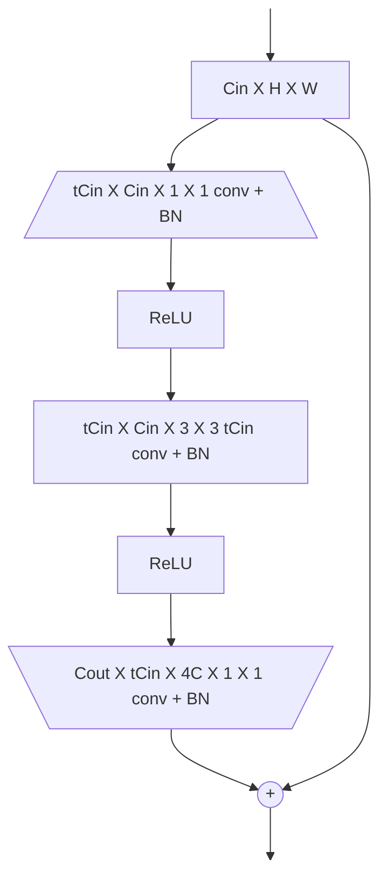

# Resnet

[CNN](pages/computer_vision/machine_learning_cv/convolutional_neural_networks.md) Inspired by [VGG](pages/computer_vision/machine_learning_cv/vgg.md) based on the concept of [residual blocks](pages/computer_vision/machine_learning_cv/convolutional_neural_networks.md#residual%20learning%20as%20a%20solution), each stage of a resnet consists in a combination of residual blocks

## Residual block structure

each residual block (*RB*) contains 2 stages of $3 \times 3$ convolution and [ReLU](pages/computer_vision/machine_learning_cv/deep_learning_and_neural_networks.md#activation%20function) non-linearity, the input of a RB block is summed to the output

The first RB in most stages halves the spatial resolution (*$S=2$ conv + $2\times 2$ max
pool*) and doubles the number of channels.

## Summing input and output

Input layer and output of a RB block are tensors of different shapes and cannot be added together

In order to address this situation a stage is added in the shortcut branch to increase the number of layers of the input

## Increasing depth with bottleneck residual blocks

In order to increase even further the depth of a [CNN](pages/computer_vision/machine_learning_cv/convolutional_neural_networks.md) without increasing the computational cost bottleneck residual blocks are used which uses a pair of convolutional block to compress and decompress layers, this can cause information loss cause convolution and parameter learning are carried out in a compressed domain:

### Avoid the information loss

in order to overcome the limitation of [bottleneck residual blocks](#Increasing%20depth%20with%20bottleneck%20residual%20blocks) mobilenet-v2 improved the model by using inverted blocks

To improve performance the convolution step is performed as a [depthwise convolutions](pages/computer_vision/machine_learning_cv/convolutional_neural_networks.md#depthwise%20separable%20convolutions), another improvement (*proved by experimental evidence*) is the absence of non linear blocks between residual blocks
## Resnet training

In the training phase dropouts is not deployed because the use of batch normalization acts as regularizer

| HYPERPARAMETER                   | VALUE                                                   |
| -------------------------------- | ------------------------------------------------------- |
| Traiming Iterations              | $60 \times 104$                                         |
| Optimizer                        | SGD with $B=256$                                        |
| Learning Rate                    | $0.1$, divided by 10 when the validation error plateaus |
| Weight Decay                     | $0.0001$                                                |
| Momentum                         | $0.9$                                                   |
| Data Augmentation, Normalization | Same as [VGG](pages/computer_vision/machine_learning_cv//vgg.md)                                   |
| Initialization                   | He initilization                                        |

[<](pages/computer_vision/machine_learning_cv/vgg.md)
