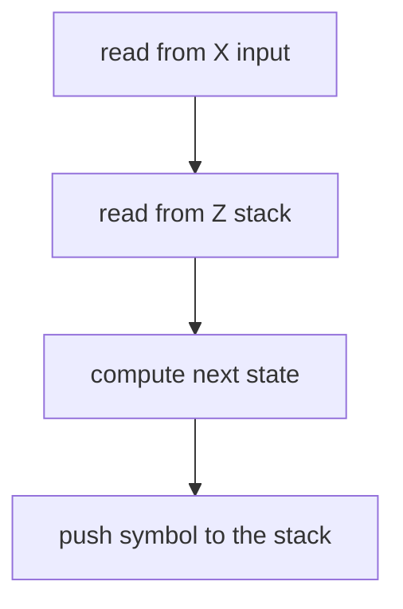

Per poter riconoscere i linguaggi di [tipo 2](/linguaggi_modelli_computazionali/grammatiche_tipo_2) e necessario poter processare stringhe che presentino forme di [self embedding](/linguaggi_modelli_computazionali/grammatiche_tipo_2#self-embedding), di conseguenza un [automa a stati finiti](/linguaggi_modelli_computazionali/rsf) non sarebbe in grado in quanto dovrebbe avere un numero di stati non noto a priori (*non finiti*)

Viene quindi introdotto il **push down automaton** (PDA), la differenza rispetto a un [automa a stati finiti](/linguaggi_modelli_computazionali/rsf) e la presenza di uno stack quindi la funzione di stato $sfn$  considera anche l'insieme dell alfabeto interno Z come ingresso $sfn:A\times Z \rightarrow S\times Z^*$

$$
<A, S, S_0, sfn, Z, Z_0>
$$

Dove:

- $A$ e un alfabeto
- $S$ e l'insieme degli stati
- $S_0$  e lo stato iniziale ($S_0 \in S$)
- $F$ e l'insieme degli stati finali
- $Z$ l'alfabeto degli **elementi che possono essere inseriti nello stack** (*alfabeto interno*)
- $sfn$ e la funzione di stato che computa lo stato futuro del sistema e il nuovo simbolo dello stack in funzione dell'input e del simbolo in cima allo stack

## Processo di riconoscimento

Per ogni stato l'automa calcola lo stato futuro e il simbolo da inserire nello stack in funzione dell'ingresso e del simbolo in cima allo stack



## Criteri di riconoscimento

Si può definire l'insieme delle frasi riconosciute da un PDA con due criteri

| <br>CRITERIO DELLO STACK VUOTO                                   | <br>CRITERIO DEGLI STATI FINALI                                                               |
| ---------------------------------------------------------------- | --------------------------------------------------------------------------------------------- |
| Un PDA riconosce correttamente una frase se essa svuota lo stack | Un PDA riconosce correttamente una frase se raggiunge uno stato finale (*come [RSF](/linguaggi_modelli_computazionali/rsf)*) |

## Pda non deterministici

I PDA come gli RSF possono presentare regole non deterministiche, ovvero produzioni dove l'automa non e in grado di decidere in quale stato portarsi

Un PDA e non deterministico se con un singolo ingresso si porta in più stati futuri:

$$
sfn(Qi, x, Z) = { (Q1,Z1), (Q2,Z2), … (Qk, Zk) }
$$

Oppure se può transitare di stato senza consumare l'ingresso

$$
sfn(Qi, x, Z) \space e \space sfn(Qi, \epsilon, Z)
$$

A differenza degli [RSF](/linguaggi_modelli_computazionali/rsf) i PDA non sempre possono essere portati in una forma deterministica equivalente, inoltre

> *la classe di linguaggi di [tipo 2](/linguaggi_modelli_computazionali/grammatiche_tipo_2) coincide con quella riconosciuta da un PDA non deterministico*

Inoltre i tempi di riconoscimento di un PDA non deterministico non sono lineari (*pessime prestazioni*), tuttavia

> *alcuni linguaggi context free sono riconoscibili da PDA deterministici*

Di conseguenza e sufficiente definire linguaggi context free di questa particolare sottoclasse per poter avere tempi di risoluzione lineari

### Svantaggi di un pda deterministico

Un PDA deterministico presenta alcuni svantaggi rispetto a un PDA non deterministico, in particolare

- il criterio dello stack vuoto risulta meno potente del criterio stati finali
- una limitazione sul numero di stati interni o sul numero di configurazioni finali riduce l'insieme dei linguaggi riconoscibili
- l'assenza di $\epsilon -mosse$ riduce l'insieme dei linguaggi riconoscibili.

## Implementazione di un pda: analisi ricorsiva discendente

Un modo intelligente per implementare un PDA deterministico e quello di sfruttare le capacita dei linguaggi, che già gestiscono memorie stack (*praticamente tutti quelli che supportano la ricorsione*)

In questo tipo di implementazione ogni metasimbolo $S$ si mappa in una funzione che ne riconosce il sottolinguaggio generato dalle produzioni che hanno il metasimbolo sulla sinistra

Per esempio, un caso molto rilevante come il bilanciamento delle parentesi può essere riconosciuto come segue, data la grammatica

$$
S \rightarrow (S)|c
$$

Si ottiene il seguente riconoscitore implementato sfruttando l'analisi ricorsiva discendente

```python
# variabili di comodo e input fissato (per semplicita)
i=0
text="(((c)))"

# funzione di comodo per ottenere il prossimo carattere della stringa
def next():
  global i
  result=text[i]
  i+=1
  return result

# metasimbolo S
def S():
  c=next()
  if c == 'c':
    return True
  if c == '(':
    if S():
      if next() == ')':
        return True
    else:
        return False
  return False

# esecuzione dello scopo della grammatica e controllo risultato
if S() and len(text) == i: print("good")
else: print("bad")
```

### Improvement ingegneristici: separazione fra engine e regole

L'implementazione come mostrata sopra risulta intuitiva ma poco scalabile, e molto più vantaggioso separare il motore del PDA dalle regole stesse della grammatica tramite una tabella di parsing, dato il linguaggio che segue

$$
S ->0S0\vert 1S1\vert c
$$
la tabella di parsing risultante:

|     | 0                   | 1                   | c                 |
| --- | ------------------- | ------------------- | ----------------- |
| $S$ | $S \rightarrow 0S0$ | $S \rightarrow 1S1$ | $S \rightarrow c$ |


### Limiti dell'analisi ricorsiva discendente

L'analisi ricorsiva discendente e applicabile solo in caso in cui la grammatica sia deterministica, ovvero deve essere possibile dedurre la produzione corretta dalle informazioni disponibili in quel momento(*no guessing*)

- stato attuale
- memoria del passato (*stack*)
- ma anche **parte del input ancora da consumare**

Risulta quindi necessario definire un sottoinsieme di linguaggi di [tipo 2](/linguaggi_modelli_computazionali/grammatiche_tipo_2) che siano riconoscibili in maniera deterministica guardando al più $k$ simboli in avanti, e il caso delle [grammatiche llk](/linguaggi_modelli_computazionali/grammatiche_llk)
