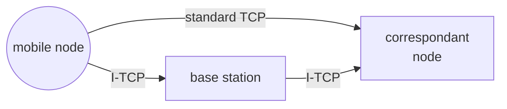

#  I-TCP

[MIP](pages/mobile_systems/mobility/mobile_ip.md) [HMIPV6](pages/mobile_systems/mobility/hierarchical_mobile_ipv6.md) [PHMIPV6](pages/mobile_systems/mobility/proxy_hierarchical_mobile_ipv6.md)  does not take in to account the problems that occurs at the transport layer as for the **TCP protocol every disconnection and reconnection is treated as a high congestion situation**, so TCP slows traffic to resolve the congestion

The idea in I-TCP is to split the connection exploiting a middle node

## Handoff

The handoff procedure is dependent on the [mobile ip **one**](pages/mobile_systems/mobility/mobile_ip.md), when a mobile node register is CoA at the home agent, I-TCP handoff starts and in the meantime packets are buffered at the middle node

## Advantages

- flow and congestion control are separated in the 2 segments
- retrocompatibility with TCP

## Disadvantages

- Breaks the end to end principle for witch only the endpoint of the communication are aware of the communication channel
- the middle node maintains state

[<](pages/mobile_systems/mobility/proxy_hierarchical_mobile_ipv6.md)[>](pages/mobile_systems/mobile_middleware/mobile_middleware.md)
