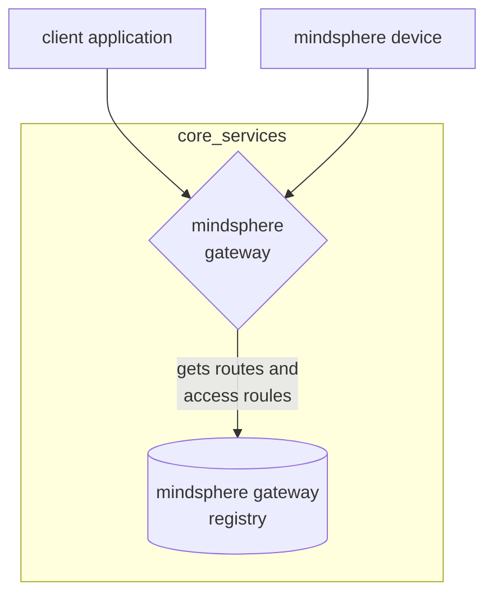

# Siemens mindsphere platform

Siemens cloud and edge based solution for IoT

### Handle connection to devices

the mindconnect layer is the one responsible for offering the connection support to the IoT devices, it's an all-in-one hardware/software solution that provides connectivity for the most popular industrial protocols such as

### Mindsphere gateway

Mindsphere infrastructure relies on a central gateway to handle request from application components and devices that want to send data

### Mindsphere iot services

- **File Service**: provides a basic file management tools with an interface to manage, search and download data. Each file is linked to an asset, has some properties that describe it and can be retrieved after a connection to the IoT gateway. APIs provide CRUD operations on files.

- **Time Series service**: a service similar to File service, but only for the data type time series. Time series records are linked to an asset and an aspect and consist of a timestamp, one or more values and a quality indicator for variables.

- **Aggregation service**: creates aggregated summaries of time series data and interfaces to read them. It is particularly useful to reduce the amount of data sent to cloud for analysis. Once chosen a time interval to aggregate provides standard aggregate information such as min, max, average, tot number of points

### Mindsphere connectivity services

- **Agent management service**: provides API to create, update, delete and manage the rights of agents. Agents are the primary actors that perfom actions on data in Mindsphere, when created they are assigned an access token which is the key to get authenticated and autorized to communicate

- **MindConnect API**: API to send data securely from the shop floor devices to Mindsphere. Only agents that supports HTTP processing, TLS and JSON parsing have the requirements to communicate. It allows also to set the configuration for both the data source from which retrieve the data and the data model to be shared

- **OPC UA PubSub Service**: specific module that provides MQTT- based API to agents to upload data according to OPC UA specification

[<](pages/mobile_systems/iot/azure_iot_platform.md)[>](pages/mobile_systems/iot/edgex_iot_platform.md)
