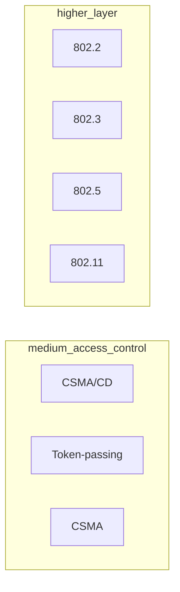
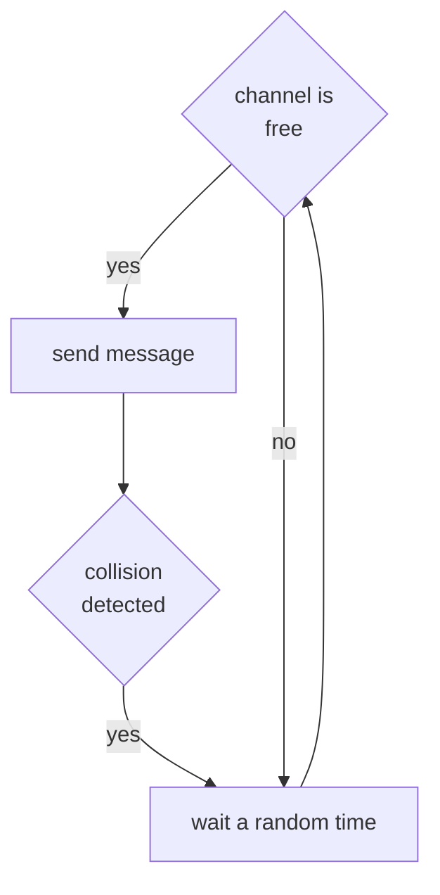
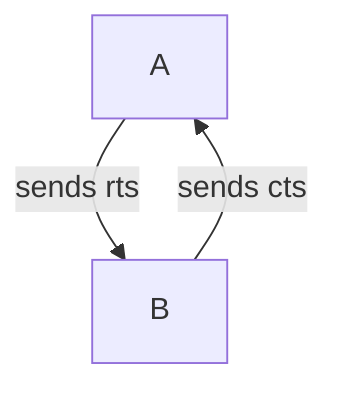
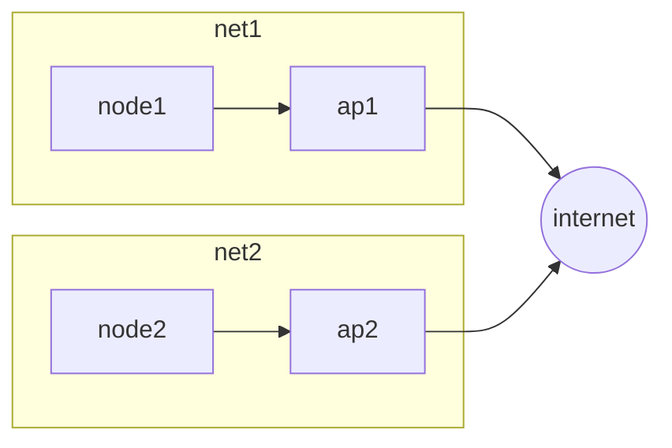
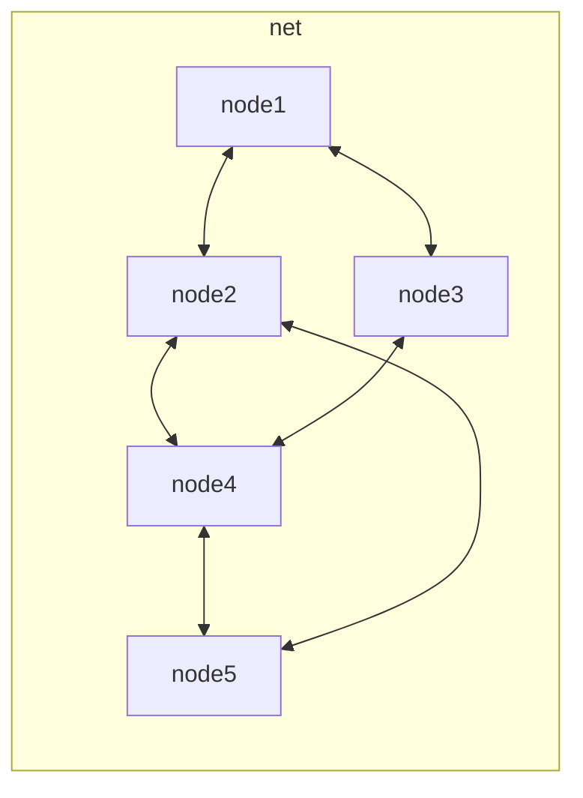

To understand better the problem that mobile device's software have to face we need to analyze the physical medium that allows this devices to communicate, the wireless medium.

## Wireless medium

The physical layer over wireless medium has a lot of problems due to the signal nature:

- **shadowing**
- **frequency-selective fading**
- **Rayleigh fading**

Signal can also bounce over reflective surfaces generating reflections

There are also meteorological conditions that can influence the signal strength.

In real scenarios with mobile nodes, mathematical models cannot be used to estimates the power loss due to the nature of the environment been to variable.

In general it can be said that power fluctuations depends on the distance from the transmitter.

> [!IMPORTANT]
> **layer 2 protocols need to take into account this physical layer problems**

## Medium access control

IEEE defines a section of standards for wireless connectivity technologies at data link layer under the section 802.xx

## Wirelles medium access control protocols

To manage the medium access control there are different protocols in the litterature

### Csma/cd

The **CSMA/CD** relies on sensing the channel and transmit only when the channel il free

In wireless environment this approach have some issues due to the nature of the nodes not being able to listen the entire channel and the node mobility

### Hidden and exposed node issues

This are particular problems that can manifest in a wireless environment where the communication is obstructed from the presence of one or more nodes in the range of the transmitter and receiver

 

### Csma/ca variant

A way to limit the hidden/expose node issue is to send short acknowledgment frames before transmit:

So the node **A** sends a request to send packet to **B** and wait for a clear to send reply before start transmitting the data

This solution limits collisions only to the **rts** and **cts** packets reducing the cost of re transmission but increase the overhead because every communication requires an rtc/cts exchange

## Wireless architectures

There are two possible configuration for a wireless infrastructure:

### Base station mode

The nodes are connected to a base station and communication can only append trough the base station itself

### Ad hoc mode

All nodes are potentially mobile and communicate directly

